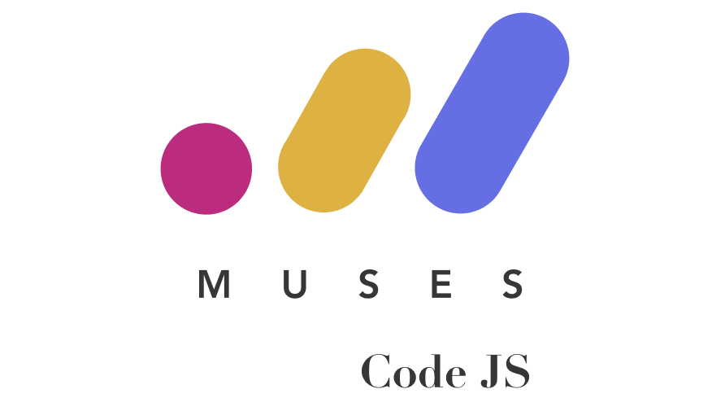

# Intro to JavaScript



An introductory JavaScript workshop for beginners.

## Slides

Check on slides, click [here](https://goo.gl/5HNvxD).

## Feedback

To leave feedback click [here](https://docs.google.com/forms/d/e/1FAIpQLSdoOaviRIqsDPi1ZPTvTDVEzeQrSiEoDhsS0tmAIQZmkLkvxw/viewform?c=0&w=1).

## Getting Started

If you are familiar with Git, you can clone this repository to your machine.

If you don't know what Git is, relax. You can easily download the folder on your machine - go to green `Clone or download` button in the top right corner and click `Download Zip`.


Unzip (extract) and open the folder, don't open files inside the .zip.

Start from the `README.md` file, then read the `Getting Started` section to begin.

To see the web-page in your browser, open `muses-code-website/index.html` by double clicking on it; if you see an option to 'open in browser' then choose that. Preferably use Chrome, but Firefox and Safari will work as well.

Follow the instructions given in each step and type code in your text editor (this is where your code lives and you can write, edit and delete code).

In order to see anything that you edit, you need to save the file and refresh the web page. The result of any `console.log()` statement will be in the _browser console_.

### How to open the `Browser Console`

| Browser | Platform | Instruction |
| --- | --- | --- |
| **Chrome** | Any | right-click the page and select `Inspect`, switch to `Console` tab in the developer tools |
| **Chrome** | Mac | press `COMMAND + OPTION + J` |
| **Chrome** | Windows | press `CONTROL + SHIFT + J` |
| **Firefox** | Any | right-click the page and select `Inspect Element`, switch to `Console` tab |
| **Firefox** | Mac | press `COMMAND + OPTION + K` |
| **Firefox** | Windows | press `CONTROL + SHIFT + K` |
| **Safari** | Mac | go to the menu bar and open `Safari > Preferences > Advanced >` and tick the box `Show Develop Menu` at the bottom, restart Safari, now you can right-click on the page and select `Inspect Element` to see the console. |
| **Safari** | Mac | press `COMMAND + OPTION + C` |

The console/developer tools will appear at the bottom or on the right side of the screen.

You can write JavaScript code directly into the browser console and see the result straight away, but as soon as you refresh the page all the code will be gone, this is why we use a text editor in order to save our code.

## Structure

Inside this project you will find the `muses-code-website` folder. We will be editing the contents of this folder during the workshop. In the folder you will see three files:
- `index.html` - a file that is responsible for the structure of our project
- `style.css` - a file that is responsible for styles and how our project looks on the web
- `script.js` - a file that makes our project work, it defines content and makes a static page functional

We will be making changes to the `script.js` file.

Our project also contains:
- `README.md` - a file with explanations and any information about the project, how to run it, what it is for etc
- `cheat-sheet.md` - a file with a quick overlook for key namings and their explanations


🚦 Ready? Set. Go!

### To run locally
Unless you want to run the [Intro to JS tutorial](https://muses-code-js.github.io/intro-to-js-melbourne/) locally instead of online version to make changes to it, you do not need to follow the steps below to do the workshop.

1. [Install Ruby v2](https://www.ruby-lang.org/en/documentation/installation/) if you don't already have it.

2. Install bundler:
    ```
    gem install bundler
    ```
3. Install Ruby dependencies:
    ```
    bundle install
    ```

4. Then, run Jekyll command to serve the website locally on http://127.0.0.1:4000:
    ```
    bundle exec jekyll serve
    ```